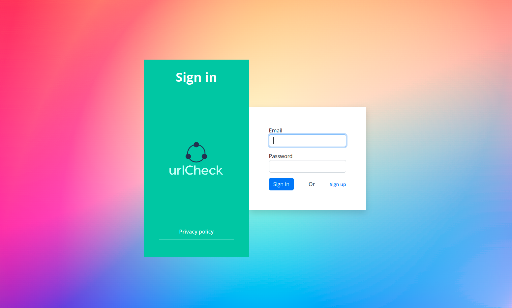
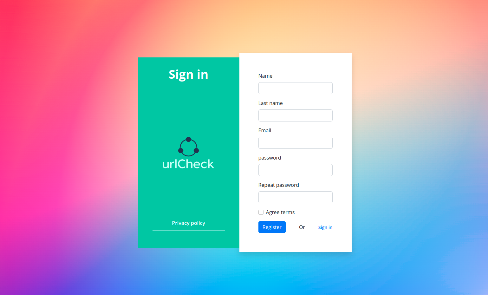
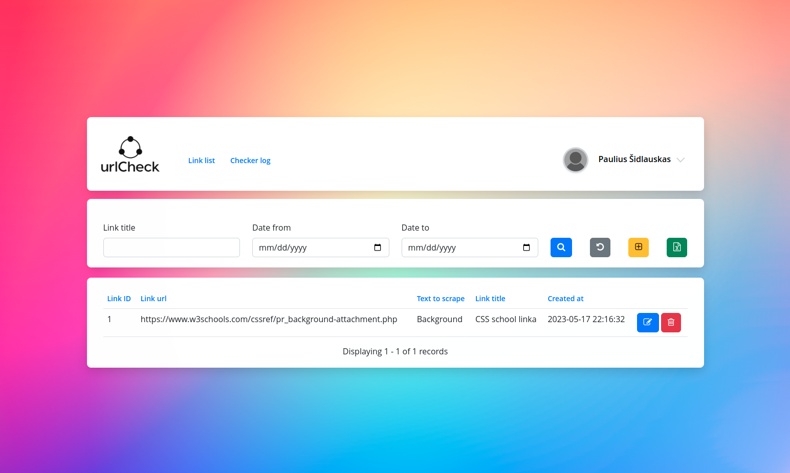
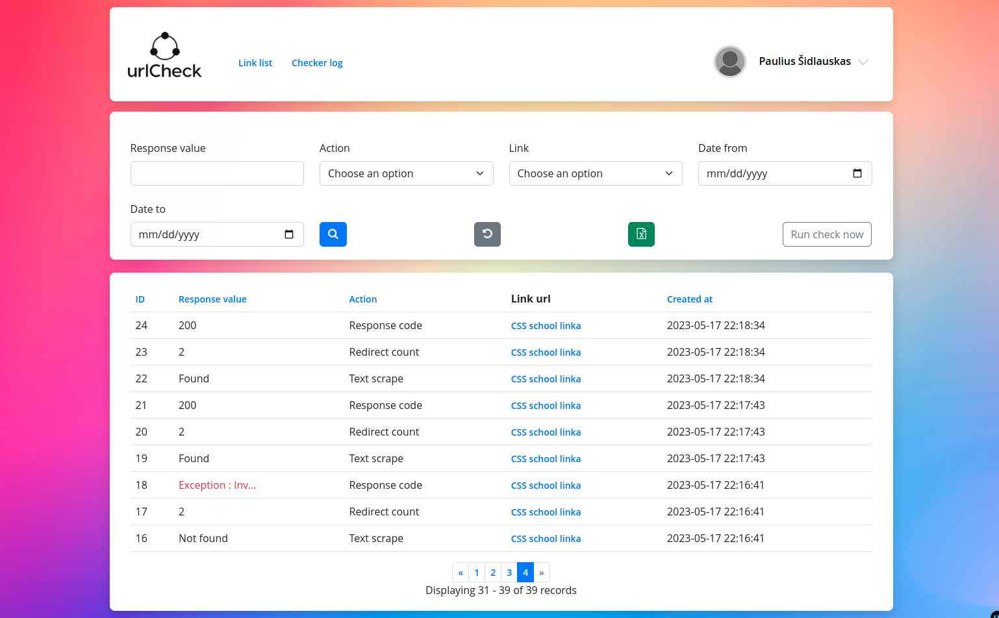

**SIMPLE LINK CHECKER "urlCheck"**

**Features:**
- Login/Register
- Login/register validation
- Manage users, admin user creation can be done via symfony CLI interface. Managing was made possible with EasyAdmin bundle.
- Link CRUD,delete functionality has SWAL alert modal, for more convenience
- Link have pagination
- Link filtering by date user has chosen, createdAt/updatedAt values are for general purposes, primarily for easier debugging when system is in use
- Url checking with the same functionality and CRON command
- User may edit his profile and change password or other fields
- User may export his links and filter them by date or title
- Usage of roles, they may be changed in the admin panel
- Fully responsive mobile design

**Technical specs:**
- Symfony 6.2 (NON LTS, that is against the requirements of the task, but the reason is that SF6.4 with support up to 2027 will roll out this october, thus there will be an easier update, than from 5.4)
- PHP 8.1
- Bootstrap grid and other minimal styles, for easier further development
- Translation bundle, for easier multi-language functionality if requested
- Usage of webpack, for easier asset management
- Usage of traits, for cleaner development, same goes for interfaces
- Custom styling was completed using BEM naming convention
- Usage of docker development environment

**Setup:**
1. docker instructions https://github.com/StaffNowa/docker-symfony/tree/1.0.18/ OR use provided files from we transfer
2. clone https://github.com/PonasVoras/urlCheck to the required folder project/symfony in the docker
3. set configuration just like in the provided wetransfer link
4. check docker config env file and symfony env.local
5. add urlcheck.local to /etc/hosts just put "127.0.0.1       urlcheck.local"
6. check if mysql is working going to urlcheck.local:8080 login with credentials existent in docker env file
7. go to docker container and straight to symfony directory and run "php bin/console doctrine:schema:update -f"
8. http://urlcheck.local/regiser
9. Register on the platform
10. SETUP crontab, depending on the server, edit accordingly (crontab -e (must have SUDO rights, to save)):
- 0 8 * * * /usr/bin/php /home/urlcheck/web/symfony/bin/console cron check-links
- 0 20 * * * /usr/bin/php /home/urlcheck/web/symfony/bin/console cron check-links

**Solutions-Reasons:**
- Login/Register functionality - for system to be secure and independent of user
- Logging in the database - For easier management, filtering of logs
- Event Subscriber - for system to independently add/modify handling of success/failure events
- Logging in logs - for having trace of the error
- Link checker handlers in independent classes, for easier creation of new ones, modification of existing ones
- NO IMPLEMENTATION OF redirect count - time saving, lack of analysis
- 

**WeTransfer link for docker: https://we.tl/t-Z1iRZ9VHap** 

**Link for demonstration video: https://we.tl/t-6zQOtF95XP** 